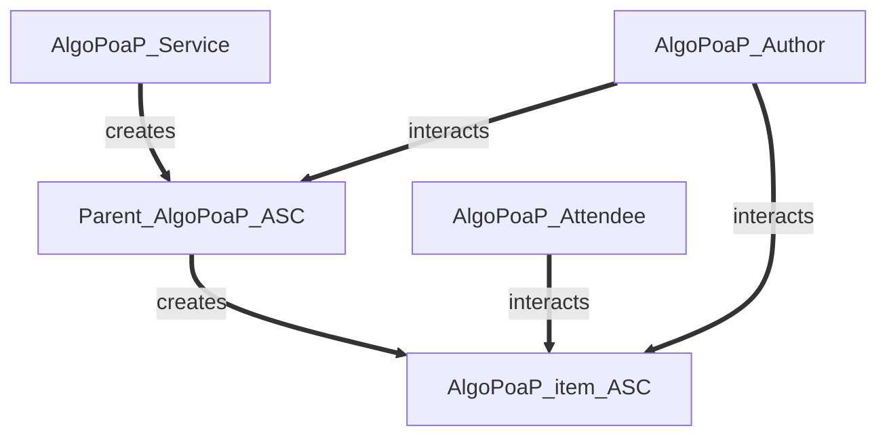
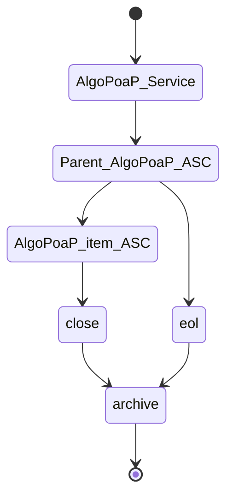
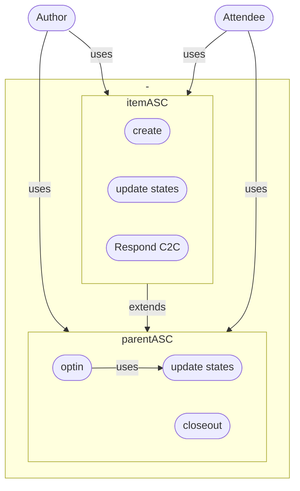
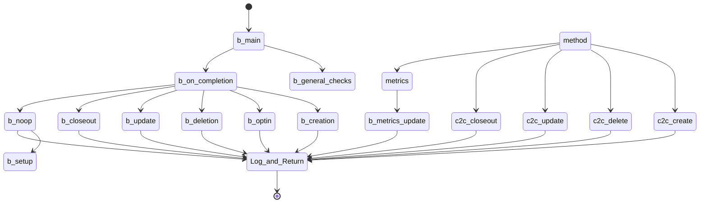
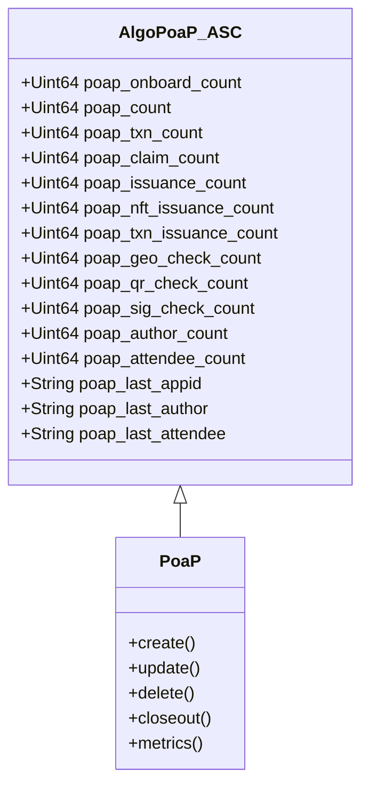
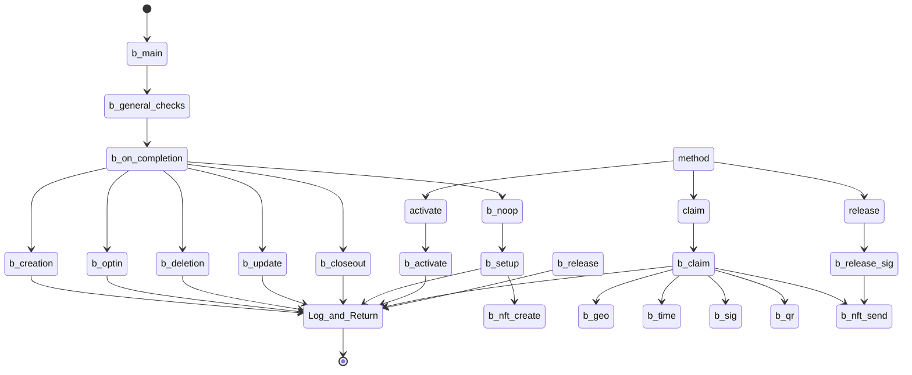
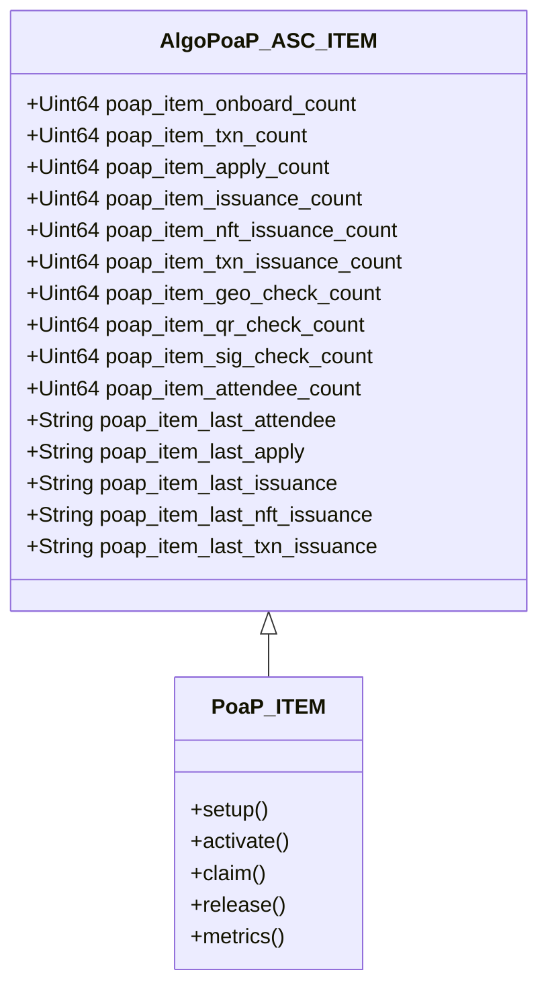

# AlgoPoaP Smart Contracts 
**This repository contains SmartContracts for AlgoPoaP dApp on Algorand.**

[AlgoPoaP's Frontend Repository](https://github.com/AlgoPoaP/algopoap)

AlgoPoaP ASC System is designed on basis of newest TEAL features came with TEAL v 6.0 on AVM V1.1. AlgoPoaP Parent contract is created and thereafter every AlgoPoaP item is created by this parent contract based on configurations needed.

----
### Entities Relations:

----

### Lifecycle:

----

### UseCase:

----

### AlgoPoaP ASC TEAL Graph:

----

### AlgoPoaP ASC ABI :

----

### AlgoPoaP Item ASC TEAL Graph:

----
### AlgoPoaP ASC ITEM ABI :

