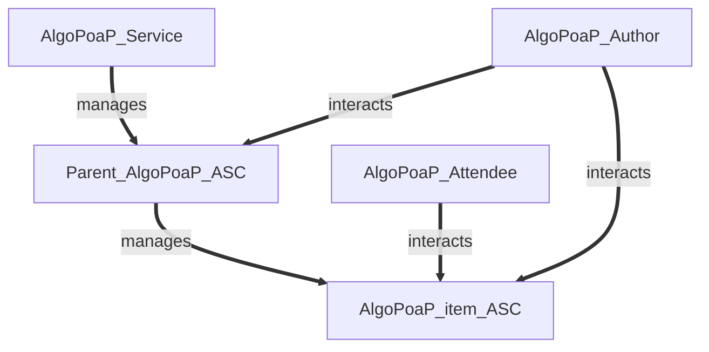

# AlgoPoaP Smart Contracts 

**This repository contains SmartContracts for AlgoPoaP dApp on Algorand.**

- [AlgoPoaP's Frontend Repository](https://github.com/AlgoPoaP/algopoap)

- [AlgoPoaP Documentation](https://github.com/AlgoPoaP)

- [AlgoPoaP Website (algopoap.com)](https://algopoap.com)

- [AlgoPoaP dApp (algopoap.xyz)](https://algopoap.xyz)
 
- [Algorand NFDomain (algopoap.algo)](https://app.nf.domains/name/algopoap.algo)

AlgoPoaP is the Proof of Attendance Protocol built on Algorand (AVM V1.1) which aims to be elevated into a Proof Of Anything Protocol in future with use of already in beta state proofs feature on Algorand (Proof of Anything is Parallel WIP in R&D phase using DevNET)

AlgoPoaP ASC System is designed on basis of newest TEAL features came with TEAL v 6.0 on AVM V1.1. AlgoPoaP Parent contract is created and thereafter every AlgoPoaP item is created by this parent contract based on configurations needed.

----

