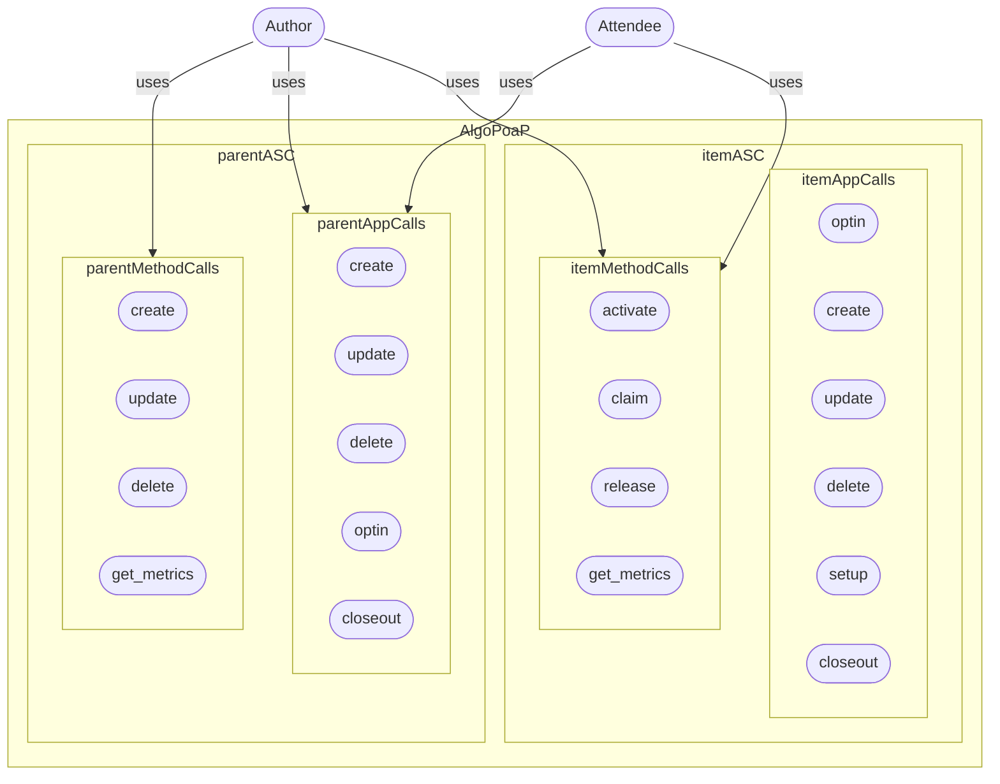

# AlgoPoaP Smart Contracts 
**This repository contains SmartContracts for AlgoPoaP dApp on Algorand.**

[AlgoPoaP's Frontend Repository](https://github.com/AlgoPoaP/algopoap)

AlgoPoaP ASC System is designed on basis of newest TEAL features came with TEAL v 6.0 on AVM V1.1. AlgoPoaP Parent contract is created and thereafter every AlgoPoaP item is created by this parent contract based on configurations needed.


----
### Entities Relations:


----

### Lifecycle:


----


### UseCase:


----

### AlgoPoaP ASC TEAL Graph:


----

### AlgoPoaP ASC ABI :

Note 1: Data fields are global states of AlgoPoaP parent smart contract.

Note 2: Fee collection is not included anywhere at this phase of AlgoPoaP MVP development but certainly is a priority prior to public TESTNET deployment. It happens on parent smart contract.


Note 1: Author has all metrics in localState of AlgoPoaP Item smart contract and all Authored AlgoPoaPs (upt to 16 item) in localState of AlgoPoaP smart contract (parent) 

----

### AlgoPoaP ASC ABI Schema :
```js
{
    "name":"algopoap-contract",
    "desc": "AlgoPoaP Parent smart contract",
    "networks":{
        "MainNet":{
            "appID": 0
        },
        "TestNet":{
            "appID": 0
        }
    },
    "methods":[
        {
            "name": "create",
            "args": [
              {
                "type": "pay",
                "name": "pay"
              },
              {
                "type": "byte[]",
                "name": "asc_approval_bytes"
              },
              {
                "type": "byte[]",
                "name": "asc_clear_bytes"
              }
            ],
            "returns": {
              "type": "uint64"
            },
            "desc": "Creates a new AlgoPoaP item smartcontract and returns the app id"
          },
          {
            "name": "update",
            "args": [
              {
                "type": "application",
                "name": "application"
              },
              {
                "type": "byte[]",
                "name": "asc_approval_bytes"
              },
              {
                "type": "byte[]",
                "name": "asc_clear_bytes"
              }
            ],
            "returns": {
              "type": "bool"
            },
            "desc": "Updates an AlgoPoaP item smartcontract and returns bool (true on success)"
          },
          {
            "name": "delete",
            "args": [
              {
                "type": "application",
                "name": "application"
              }
            ],
            "returns": {
              "type": "bool"
            },
            "desc": "Deletes an AlgoPoaP item smartcontract and returns bool (true on success)"
          },
          {
            "name": "get_metric",
            "args": [
              {
                "type": "string",
                "name": "metric_signature"
              }
            ],
            "returns": {
              "type": "byte[]"
            },
            "desc": "Gets an specific metric by signature string"
          },
          {
            "name": "get_metrics",
            "args": [],
            "returns": {
              "type": "byte[]"
            },
            "desc": "Gets an specific metric by signature string"
          }
    ]
}

```
----

### AlgoPoaP Item ASC TEAL Graph:


----

### AlgoPoaP ASC ITEM ABI :

Note 1: Data fields are global states of AlgoPoaP item smart contract.


----

### AlgoPoaP ASC ITEM ABI Schema :
```js
{
    "name": "algopoap-item-contract",
    "desc": "AlgoPoaP Item smart contract",
    "networks": {
        "MainNet": {
            "appID": 0
        },
        "TestNet": {
            "appID": 0
        }
    },
    "methods": [
        {
            "name": "activate",
            "args": [
                {
                    "type": "appl",
                    "name": "parent_call"
                },
                {
                    "type": "pay",
                    "name": "pay_min_fees"
                },
                {
                    "type": "axfer",
                    "name": "optin_algopoap_nft"
                }
            ],
            "returns": {
                "type": "byte[]"
            },
            "desc": "Activates an AlgoPoaP item smart contract and returns all metrics"
        },
        {
            "name": "claim",
            "args": [
                {
                    "type": "appl",
                    "name": "parent_call"
                },
                {
                    "type": "pay",
                    "name": "pay_min_fee"
                },
                {
                    "type": "axfer",
                    "name": "optin_algopoap_nft"
                },
                
                {
                    "type": "account",
                    "name": "attendee_account"
                },
                {
                    "type": "uint16",
                    "name": "lat_1"
                },
                {
                    "type": "uint48",
                    "name": "lat_2"
                },
                {
                    "type": "uint24",
                    "name": "lng_1"
                },
                {
                    "type": "uint48",
                    "name": "lng_2"
                },
                {
                    "type": "uint24",
                    "name": "geo_buffer"
                },
                {
                    "type": "uint64",
                    "name": "timestamp"
                },
                {
                    "type": "string",
                    "name": "qr_secret"
                }
                
            ],
            "returns": {
                "type": "string"
            },
            "desc": "Claims an AlgoPoaP for an attendee and returns NFT sending inner-transaction hash"
        },
        {
            "name": "release",
            "args": [
                {
                    "type": "appl",
                    "name": "parent_call"
                }
            ],
            "returns": {
                "type": "byte[]"
            },
            "desc": "Releases AlgoPoaP and allows all AlgoPoaP attendee's to start claiming"
        },
        {
            "name": "get_metric",
            "args": [
                {
                    "type": "string",
                    "name": "metric_signature"
                }
            ],
            "returns": {
                "type": "byte[]"
            },
            "desc": "Gets an specific metric by signature string"
        },
        {
            "name": "get_metrics",
            "args": [],
            "returns": {
                "type": "byte[]"
            },
            "desc": "Gets an specific metric by signature string"
        }
    ]
}

```
----


Since AlgoPoaP is totally decentralized, trustless and permission-less: Every AlgoPoaP item author has full authority of the created PoaPs (AlgoPoaP-DAO is coming with dao, voting and governance features in near future, after startup formation. Preferably I will use integration to an already working service with ABI)!

The algopoap_contract.json contains the ABI Schema for parent AlgoPoaP contract and algopoap_item_contract.json is the full ABI Schema of AlgoPoaP item contract which will be created by an C2C call via an inner transaction.


```js
{
    "name": "algopoap-item-contract",
    "desc": "AlgoPoaP Item smart contract",
    "networks": {
        "MainNet": {
            "appID": 0
        },
        "TestNet": {
            "appID": 0
        }
    },
    "methods": [
        {
            "name": "activate",
            "args": [
                {
                    "type": "appl",
                    "name": "parent_call"
                },
                {
                    "type": "pay",
                    "name": "pay"
                }
            ],
            "returns": {
                "type": "byte[]"
            },
            "desc": "Activates an AlgoPoaP item smart contract and returns all metrics"
        },
        {
            "name": "claim",
            "args": [
                {
                    "type": "appl",
                    "name": "parent_call"
                },
                {
                    "type": "pay",
                    "name": "pay"
                },
                {
                    "type": "account",
                    "name": "attendee_account"
                },
                {
                    "type": "uint16",
                    "name": "lat_1"
                },
                {
                    "type": "uint48",
                    "name": "lat_2"
                },
                {
                    "type": "uint24",
                    "name": "lng_1"
                },
                {
                    "type": "uint48",
                    "name": "lng_2"
                },
                {
                    "type": "uint24",
                    "name": "geo_buffer"
                },
                {
                    "type": "uint64",
                    "name": "timestamp"
                },
                {
                    "type": "string",
                    "name": "qr_secret"
                }
                
            ],
            "returns": {
                "type": "string"
            },
            "desc": "Claims an AlgoPoaP for an attendee and returns NFT sending inner-transaction hash"
        },
        {
            "name": "release",
            "args": [
                {
                    "type": "appl",
                    "name": "parent_call"
                }
            ],
            "returns": {
                "type": "byte[]"
            },
            "desc": "Releases AlgoPoaP and allows all AlgoPoaP attendee's to start claiming"
        },
        {
            "name": "get_metric",
            "args": [
                {
                    "type": "string",
                    "name": "metric_signature"
                }
            ],
            "returns": {
                "type": "byte[]"
            },
            "desc": "Gets an specific metric by signature string"
        },
        {
            "name": "get_metrics",
            "args": [],
            "returns": {
                "type": "byte[]"
            },
            "desc": "Gets an specific metric by signature string"
        }
    ]
}

```
----

Since AlgoPoaP is totally decentralized, trustless and permission-less: Every AlgoPoaP item author has full authority of the created PoaPs (AlgoPoaP-DAO is coming with dao, voting and governance features in near future, after startup formation. Preferably I will use integration to an already working service with ABI)!

The algopoap_contract.json contains the ABI Schema for parent AlgoPoaP contract and algopoap_item_contract.json is the full ABI Schema of AlgoPoaP item contract which will be created by an C2C call via an inner transaction.