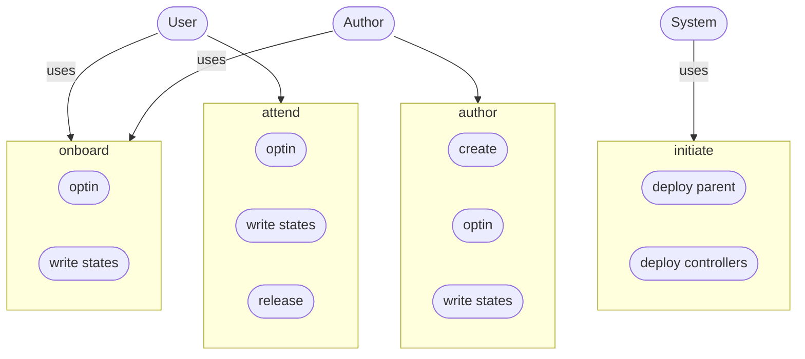

# AlgoPoaP Smart Contracts 

**Algorand SmartContracts for AlgoPoaP dApp and AlgoPoaP Service.**

AlgoPoaP ASC System is designed on basis of newest TEAL features came with TEAL v 6.0 on AVM V1.1. AlgoPoaP Parent contract is created and thereafter every AlgoPoaP item is created by this parent contract based on configurations needed.

----
### Entities Relations:

----
### Lifecycle:

----
### UseCase:

----

Since AlgoPoaP is totally decentralized, trustless and permissionless: Every AlgoPoaP item author has full authority of the created PoaPs (AlgoPoaP-DAO is coming with dao, voting and governance features in near future, after startup formation)!

The algopoap_contract.json contains the ABI Schema for parent AlgoPoaP contract and algopoap_item_contract.json is the full ABI Schema of AlgoPoaP item contract which will be created by an C2C call via an inner transaction.

